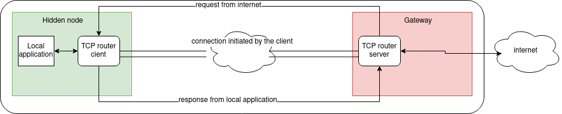

# tcprouter

A down to earth tcp router based on traefik tcp streaming and supports multiple backends using [valkyrie](https://github.com/abronan/valkeyrie)

## Build

```
git clone https://github.com/threefoldtech/tcprouter
make
```

This will generate two binaries in bin dir

- `trs`: tcp router server
- `trc`: tcp router client

## Running

Example configuration file

```toml
[server]
addr = "0.0.0.0" # listening address for all entrypoints (http, https, tcp router client)
port = 443 # TLS listening port
httpport = 80 # HTTP listening port

[server.dbbackend] # configuration for the redis backend
type 	 = "redis"
addr     = "127.0.0.1"
port     = 6379
refresh  = 10 # make the tcp router poll for new configuration every 10 seconds


[server.services]
    [server.services."mydomain.com"]
        addr = "172.217.19.46"
        tlsport = 443
        httpport = 80
```

then `trs -config router.toml`

Please notice if you are using low numbered port like 80 or 443 you can use sudo or setcap before running the binary.
- `sudo setcap CAP_NET_BIND_SERVICE=+eip trs`

### router.toml

We have two 3 sections so far

#### [server]

```toml
[server]
addr = "0.0.0.0"
port = 443
httpport = 80
```

in `[server]` section we define the listening interface/port the tcprouter intercepting: typically that's 443 for TLS connections.

#### [server.dbbackend]

```toml
[server.dbbackend]
type    = "redis"
addr    = "127.0.0.1"
port    = 6379
refresh = 10
```

in `server.dbbackend` we define the backend kv store and its connection information `addr,port` and how often we want to reload the data from the kv store using `refresh` key in seconds.

#### [server.services]

```toml
[server.services]
    [server.services."mydomain.com"]
        addr = "172.217.19.46"
        tlsport = 443
        httpport = 80
```

Services are static configuration that are hardcoded in the configuration file instead of coming from the database backend.  
In this example the request for domain `mydomain.com` will be forwarded to the backend server at `172.217.19.46:443` for TLS traffic and `172.217.19.46:80` for non TLS traffic.

## Data representation in KV

```shell
127.0.0.1:6379> KEYS *
1) "/tcprouter/services/www.bing.com"
2) "/tcprouter/services/www.google.com"
3) "/tcprouter/services/www.facebook.com"

127.0.0.1:6379> get /tcprouter/services/www.google.com
"{\"Key\":\"tcprouter/services/www.google.com\",\"Value\":\"eyJhZGRyIjogIjE3Mi4yMTcuMTkuNDYiLCAiaHR0cHBvcnQiIDgwLCAidGxzcG9ydCI6IDQ0M30=\",\"LastIndex\":75292246}"
```

### Decoding data from python

```ipython

In [64]: res = r.get("/tcprouter/service/www.google.com")

In [65]: decoded = json.loads(res)

In [66]: decoded
Out[66]:
{'Key': '/tcprouter/service/www.google.com',
 'Value': 'eyJhZGRyIjogIjE3Mi4yMTcuMTkuNDYiLCAiaHR0cHBvcnQiIDgwLCAidGxzcG9ydCI6IDQ0M30='}
```

`Value` payload is base64 encoded because of how golang is marshaling.

```ipython
In [67]: base64.b64decode(decoded['Value'])
Out[67]: b'{"addr": "172.217.19.46", "httpport" 80, "tlsport": 443}'
```

## Examples

### Go

This example can be found at [examples/main.go](./examples/main.go)

```go
package main

import (
    "encoding/json"
    "log"
    "time"

    "github.com/abronan/valkeyrie"
    "github.com/abronan/valkeyrie/store"

    "github.com/abronan/valkeyrie/store/redis"
)

func init() {
	redis.Register()
}

type Service struct {
	Addr string `json:"addr"`
	SNI  string `json:"sni"`
	Name string `json:"bing"`
}

func main() {

	// Initialize a new store with redis
	kv, err := valkeyrie.NewStore(
		store.REDIS,
		[]string{"127.0.0.1:6379" },
		&store.Config{
			ConnectionTimeout: 10 * time.Second,
		},
	)
	if err != nil {
		log.Fatal("Cannot create store redis")
	}
	google := &Service{Addr:"172.217.19.46:443", SNI:"www.google.com", Name:"google"}
	encGoogle, _ := json.Marshal(google)
	bing := &Service{Addr:"13.107.21.200:443", SNI:"www.bing.com", Name:"bing"}
	encBing, _ := json.Marshal(bing)

	kv.Put("/tcprouter/services/google", encGoogle, nil)
	kv.Put("/tcprouter/services/bing", encBing, nil)
}
```

### Python

```python
import base64
import json
import redis

r = redis.Redis()

def create_service(name, sni, addr):
    service = {}
    service['Key'] = '/tcprouter/service/{}'.format(name)
    record = {"addr":addr, "sni":sni, "name":name}
    json_dumped_record_bytes = json.dumps(record).encode()
    b64_record = base64.b64encode(json_dumped_record_bytes).decode()
    service['Value'] = b64_record
    r.set(service['Key'], json.dumps(service))

create_service('facebook', "www.facebook.com", "102.132.97.35:443")
create_service('google', 'www.google.com', '172.217.19.46:443')
create_service('bing', 'www.bing.com', '13.107.21.200:443')
```

If you want to test that locally you can modify `/etc/hosts`

```shell
127.0.0.1 www.google.com
127.0.0.1 www.bing.com
127.0.0.1 www.facebook.com
```

So your browser go to your `127.0.0.1:443` on requesting google or bing.

## CATCH_ALL

to add a global `catch all` service

`python3 create_service.py CATCH_ALL 'CATCH_ALL' '127.0.0.1:9092'`

## Reverse tunneling

TCP router also support to forward connection to a server that is hidden behind NAT. The way it works is on the hidden client side, 
a small client runs and opens a connection to the tcp router server. The client sends a secret during an handshake with the server to authenticate the connection.

The server then keeps the connection opens and is able to forward incoming public traffic to the open connection.  This is specially useful if there is no way for the tcp router server to open a connection to the backend. Usually because of NAT.



### example

Fist create the configuration on the server side. The only required field in the configuration is the secret for the client connection:

```toml
[server.services]
    [server.services."mydomain.com"]
        clientsecret = "TB2pbZ5FR8GQZp9W2z97jBjxSgWgQKaQTxEgrZNBa4pEFzv3PJcRVEtG2a5BU9qd"
```

Second starts the tcp router client and make it opens a connection to the tcp router server:
The following command will connect the the server located at `tcprouter-1.com`, forward traffic for `mydomain.com` to the local application running at `localhost:8080` and send the response back.


`trc -local localhost:8080 -remote tcprouter-1.com -secret TB2pbZ5FR8GQZp9W2z97jBjxSgWgQKaQTxEgrZNBa4pEFzv3PJcRVEtG2a5BU9qd`