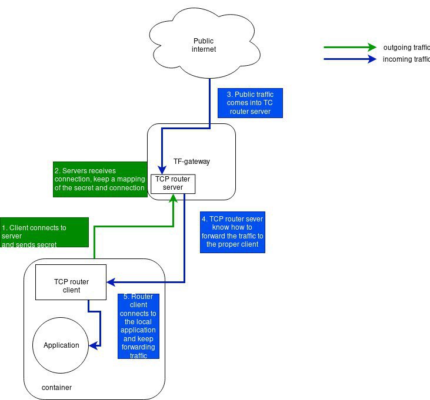

tcprouter is down to earth tcprouter with TLS routing support based on SNI and

# Server

Server launches 3 tcp servers
- http: to capture http traffic and redirect it to https.
- https: based on the SNI in the packet it gets forwarded to the right backend (coming from toml/database backend or both) 
- client listener: listens for connections coming from `tcprouterclients`

- a catch_all should be possible to handle the failing requests in case of no backend registered.

Server is configurable using toml or redis (possible to use something else)

```toml
[server]
addr = "0.0.0.0"
port = 443
httpport = 80
clientsport = 18000

[server.dbbackend]
type 	 = "redis"
username = ""
password = ""
addr     = "127.0.0.1"
port     = 6379
refresh  = 5


[server.services]
    [server.services."www.python.org"]
        addr = "151.101.240.223"
        tlsport = 443

    [server.services."www.raby-lang.org"]
        addr = "151.101.1.178"
        tlsport = 443

    [server.services."myserver.local"]
        addr = "127.0.0.1"
        httpport = 8000

```

## router.toml

We have two toml sections so far

### [server]

```toml
[server]
addr = "0.0.0.0"
port = 443
httpport = 80
clientsport = 18000
```

in `[server]` section we define the listening interface/port the tcprouter intercepting: typically that's 443 for TLS connections.

### [server.dbbackend]

```toml
[server.dbbackend]
type    = "redis"
addr    = "127.0.0.1"
port    = 6379
refresh = 5
```

in `server.dbbackend` we define the backend kv store and its connection information `addr,port` and how often we want to reload the data from the kv store using `refresh` key in seconds.

## Data representation in KV

```shell
127.0.0.1:6379> KEYS *
1) "/tcprouter/services/www.bing.com"
2) "/tcprouter/services/www.google.com"
3) "/tcprouter/services/www.facebook.com"

127.0.0.1:6379> get /tcprouter/services/www.google.com
"{\"Key\":\"tcprouter/services/www.google.com\",\"Value\":\"eyJhZGRyIjogIjE3Mi4yMTcuMTkuNDYiLCAiaHR0cHBvcnQiIDgwLCAidGxzcG9ydCI6IDQ0M30=\",\"LastIndex\":75292246}"
```

### Decoding data from python

```ipython

In [64]: res = r.get("/tcprouter/service/www.google.com")

In [65]: decoded = json.loads(res)

In [66]: decoded
Out[66]:
{'Key': '/tcprouter/service/www.google.com',
 'Value': 'eyJhZGRyIjogIjE3Mi4yMTcuMTkuNDYiLCAiaHR0cHBvcnQiIDgwLCAidGxzcG9ydCI6IDQ0M30='}
```

`Value` payload is base64 encoded because of how golang is marshaling.

```ipython
In [67]: base64.b64decode(decoded['Value'])
Out[67]: b'{"addr": "172.217.19.46", "httpport" 80, "tlsport": 443}'
```

## Examples

### Go

This example can be found at [examples/main.go](./examples/main.go)

```go
package main

import (
    "encoding/json"
    "log"
    "time"

    "github.com/abronan/valkeyrie"
    "github.com/abronan/valkeyrie/store"

    "github.com/abronan/valkeyrie/store/redis"
)

func init() {
	redis.Register()
}

type Service struct {
	Addr string `json:"addr"`
	TLSPort  int `json:"tlsport"`
	HTTPPort int `json:"httpport"`
}

func main() {

	// Initialize a new store with redis
	kv, err := valkeyrie.NewStore(
		store.REDIS,
		[]string{"127.0.0.1:6379" },
		&store.Config{
			ConnectionTimeout: 10 * time.Second,
		},
	)
	if err != nil {
		log.Fatal("Cannot create store redis")
	}
	google := &Service{Addr:"172.217.19.46", HTTPPort: 80, TLSPort: 443}
	encGoogle, _ := json.Marshal(google)
	bing := &Service{Addr:"13.107.21.200", HTTPPort: 80, TLSPort: 443}
	encBing, _ := json.Marshal(bing)

	kv.Put("/tcprouter/services/google", encGoogle, nil)
	kv.Put("/tcprouter/services/bing", encBing, nil)
}
```

### Python

```python
import base64
import json
import redis

r = redis.Redis()

def create_service(domain, addr, tlsport=443, httpport=80):
    service = {}
    service['Key'] = '/tcprouter/service/{}'.format(domain)
    record = {"addr":addr, "tlsport": tlsport, "httpport": httpport}
    json_dumped_record_bytes = json.dumps(record).encode()
    b64_record = base64.b64encode(json_dumped_record_bytes).decode()
    service['Value'] = b64_record
    r.set(service['Key'], json.dumps(service))

create_service("www.facebook.com", "102.132.97.35")
create_service('www.google.com', '172.217.19.46')
create_service('www.bing.com', '13.107.21.200')
```

If you want to test that locally you can modify `/etc/hosts`

```shell
127.0.0.1 www.google.com
127.0.0.1 www.bing.com
127.0.0.1 www.facebook.com
```

So your browser go to your `127.0.0.1:443` on requesting google or bing.

## CATCH_ALL

To add a global `catch all` service

`create_service("CATCH_ALL", "102.132.97.35")`

# Client



is small network component that's supposed to live in a container (on a private network) and it will connect to tcprouter and allows sockets to be forwarded into the container using a handshake

## Examples

Adding records in backend as the previous [example](#examples), but instead of `addr`, `tlsport` and `httpport` in  the record, `clientsecret` will be used.

```python
record = {"clientsecret": <secret>}
```

## Running

```bash
./trc -local <local_application_address> -remote <tcp_router_server_address> -secret <secret>
```

**Note:** The `secret` used in running the client, MUST be the same as the one stored in backend.

# Handshake

in `handshake.go` 
```go

type Handshake struct {
	MagicNr uint16
	Secret  []byte
}
```
a packet starts with MagicNr `0x1111` and followed by secret
